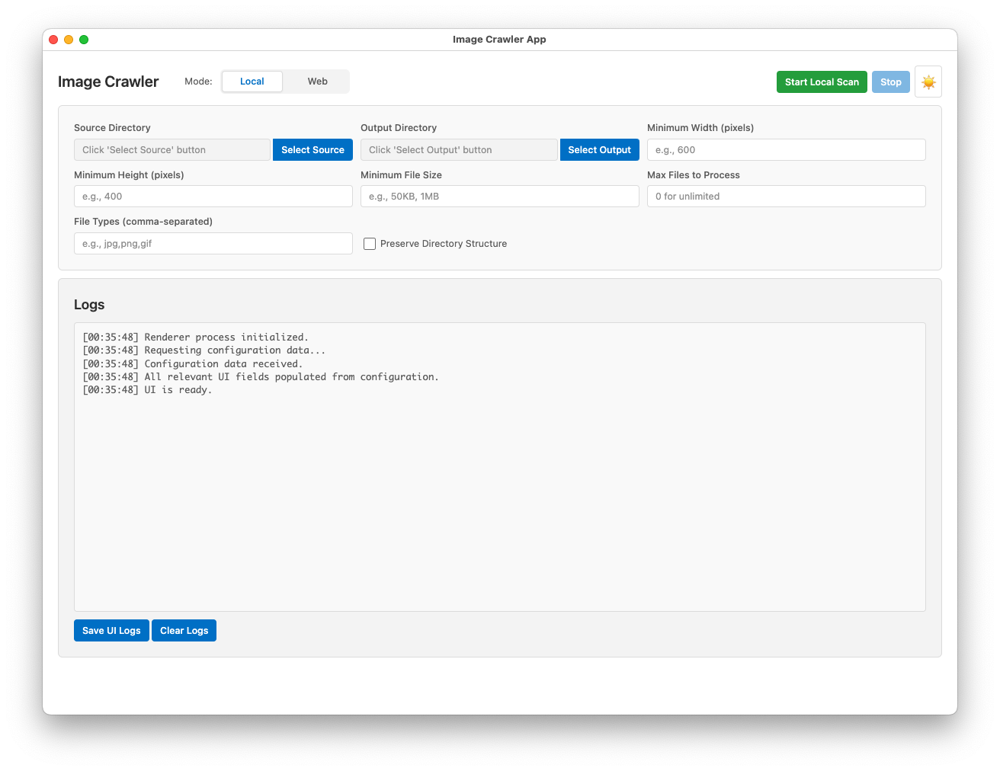
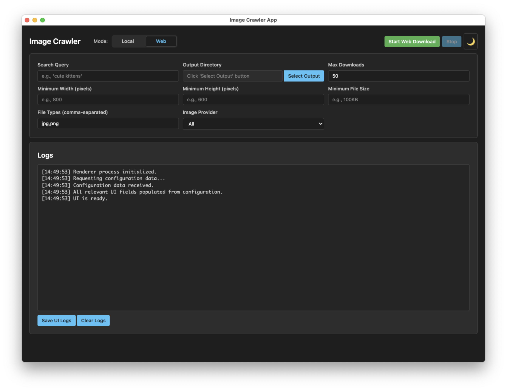

# Image Crawler
[](https://opensource.org/licenses/MIT) [](https://github.com/rupertgermann/image-crawler)
[](https://badge.fury.io/js/image-crawler) [](https://www.npmjs.com/package/image-crawler) [](https://travis-ci.org/rupertgermann/image-crawler)

A cross-platform tool for collecting images from local drives or the web.

## A Note on Authorship

This application was proudly developed 100% by AI, leveraging the capabilities of advanced coding models and the Windsurf AI engineering platform. This project showcases the power of AI in modern software development.

## Why Image Crawler?

Image Crawler was created to provide a simple, yet powerful and unified interface for downloading high-quality images from various sources or organizing local image collections efficiently.

## Showcase / Demo

Here's a glimpse of Image Crawler in action:

**Light Mode:**


**Dark Mode:**


## Features

Image Crawler offers a rich set of features through its user-friendly graphical interface and powerful command-line options:

**Graphical User Interface (GUI - Electron App):**
- **Cross-Platform:** Runs on Windows, macOS, and Linux.
- **Dual Modes:** Easily switch between Local and Web crawling modes.
- **Theme Support:** Includes Light and Dark themes for user preference.
- **Interactive Configuration:**
    - Set global default output directories.
    - Configure mode-specific output directories.
    - Adjust parameters like image dimensions, file types, and download limits directly in the UI.
- **Live Log Display:** View real-time progress and messages in the log area.
- **Log Management:** Save UI logs to a file or clear the log display with dedicated buttons.
- **Clear Controls:** Start and Stop operations easily with dedicated buttons.
- **Streamlined Notifications:** Minimized use of disruptive alert dialogs; information is primarily shown in the log area.

- **Local Mode**: Scan local directories for images
  - Filter by file type, size (min/max), and dimensions (min width/height)
  - Preserve directory structure during copy
  - Interactive folder selection for source and output
  - Deduplicate images by content hash (skips copying existing files)
  - Option to limit the maximum number of files to process
  - Windows drive selection support (via CLI, GUI uses standard folder picker)

- **Web Mode**: Download images from multiple sources
  - Supports a wide range of providers: Google Images, Pixabay, Unsplash, Pexels, Bing, Flickr, DuckDuckGo, FreeImages, and Wikimedia.
  - Search by keyword.
  - Option to limit the maximum number of downloads per provider and overall.
  - Safe search (configurable, often on by default per provider).
  - Headless browser mode for background operation (primarily a CLI feature, GUI manages this internally).

**Command-Line Interface (CLI):**
- Access to all core local and web crawling functionalities.
- Batch processing and scripting capabilities.
- Detailed control over all parameters via flags.
- (Refer to `image-crawler --help` for a full list of CLI options)

## Tech Stack
- Node.js (ES Modules)
- Playwright (for Web Mode)
- Various CLI helper libraries (e.g., yargs, chalk, inquirer)
- Modern JavaScript (ES2022+ features)

## Requirements

- Node.js 18.17.0 or later
- npm 9.0.0 or later
- Playwright browsers (installed automatically)

## Contributing

Contributions are welcome! Whether it's reporting a bug, suggesting a feature, or submitting a pull request, your help is appreciated.

### Development Documentation

For developers working on the codebase, please review the following documentation:

- **[Technical Debt Improvement Plan](docs/technical-debt-improvement-plan.md)**: Comprehensive analysis of current technical debt and improvement strategies
- **[Technical Debt Task List](docs/technical-debt-tasklist.md)**: Detailed, actionable task breakdown for addressing technical debt (17 main tasks, 55 subtasks)
- **Memory Bank**: Project context and patterns documentation in `memory-bank/` directory

The technical debt documentation identifies critical issues and provides a roadmap for:
- **Phase 1**: Critical fixes (provider registry, browser cleanup, configuration naming)
- **Phase 2**: Performance optimizations (hash caching for 70-90% startup time reduction, memory optimization)
- **Phase 3**: Code quality improvements (error handling, validation, maintainability)

All improvements maintain 100% backward compatibility and preserve existing functionality.

### Reporting Bugs

If you find a bug, please open an issue on GitHub and provide detailed steps to reproduce it. Include information about your OS, Node.js version, and the command you ran.

### Suggesting Enhancements

Have an idea to make Image Crawler better? Open an issue to discuss it. We're always looking for ways to improve.

### Pull Requests

1.  Fork the repository.
2.  Create a new branch (`git checkout -b feature/YourFeature` or `bugfix/YourBugfix`).
3.  Make your changes.
4.  Ensure your code adheres to the existing style and any linting configurations (if present).
5.  Write clear and concise commit messages.
6.  Push to your branch (`git push origin feature/YourFeature`).
7.  Open a pull request.

**Note for Contributors**: Before making significant changes, please review the technical debt documentation to understand current improvement priorities and ensure your changes align with the project's technical roadmap.

## Repository

https://github.com/rupertgermann/image-crawler

## License

This project is licensed under the [MIT License](https://opensource.org/licenses/MIT).

## Installation

### Prerequisites

1. **Node.js 18+** (v18.17.0 or later recommended for full ES modules support)
2. **Supported OS**: Windows 10/11, macOS, Linux (GUI tested, CLI is broadly compatible)

### For Users (GUI Application)

Pre-built executables for Windows, macOS, and Linux are planned for future releases. For now, please follow the developer setup to run the GUI.

### For Developers (or to run GUI from source)

1.  **Clone the repository:**
    ```bash
    git clone https://github.com/rupertgermann/image-crawler.git
    cd image-crawler
    ```

2.  **Install dependencies:**
    ```bash
    npm install
    ```

3.  **Install Playwright browsers (required for web mode):**
    ```bash
    npx playwright install --with-deps
    ```

4.  **Run the application:**
    *   To start the Electron GUI application:
        ```bash
        npm run start:electron
        ```
    *   To use the CLI:
        ```bash
        node src/index.js --help
        ```

## Usage

### GUI (Electron Application)
1. Launch the application using `npm run start:electron`.
2. Select the desired mode (Local or Web).
3. Configure the options in the UI (source/output directories, filters, query, etc.).
4. Click the "Start" button.
5. Monitor progress in the log area. Click "Stop" to halt the current operation.

### Command-Line Interface (CLI)

**Basic Examples:**

*   **Local Scan:**
    ```bash
    node src/index.js local --source "/path/to/your/images" --output "/path/to/save/copies" --fileTypes jpg,png --minWidth 800
    ```

*   **Web Download (Google Images for 'cats'):**
    ```bash
    node src/index.js web --query "cats" --output "/path/to/download/cats" --providers google
    ```

*   **Web Download (Multiple Providers for 'dogs', max 20 images):**
    ```bash
    node src/index.js web --query "dogs" --output "/path/to/download/dogs" --providers pixabay,unsplash --max-downloads 20
    ```

For a full list of options and commands, run:
```bash
node src/index.js --help
# or for specific modes
node src/index.js local --help
node src/index.js web --help
```

## Configuration

The application uses a `config.json` file (automatically created in a platform-specific user config directory) to store default settings, such as default output paths and last-used parameters. Some of these can be overridden via the GUI or CLI options.

## Troubleshooting

*   **Playwright Browser Issues**: If web mode fails, ensure Playwright browsers are correctly installed by running `npx playwright install --with-deps`. If you are behind a proxy, you might need to configure `HTTP_PROXY` and `HTTPS_PROXY` environment variables.
*   **Permissions**: Ensure the application has write permissions to the specified output directories.
*   **Long Paths (Windows)**: If you encounter errors related to path length on Windows, you may need to enable long path support in your system settings or via Group Policy.

## Contributing
{{ ... }}
